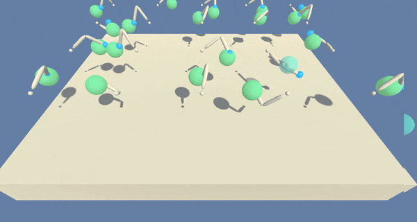

# Environment description

- Set-up: Double-jointed arms that can move to target locations.
- Goal: The agents must move their hands to the goal location and keep it there.
- Agents: The environment contains 20 agents with the same behavior parameters.
- Agent reward function (independent): +0.1 Each step agent&#39;s hand is in goal location.
- Behavior parameters:
  - Vector observation space: 33 variables corresponding to position, rotation, velocity, and angular velocities of the two arm rigid bodies.
  - Vector action space: (continuous) size of 4, corresponding to torque applicable to two joints.
- Benchmark mean reward: 30

# Distributed experience gathering

In this project, we will expedite training by using 20 non-interacting, parallel copies of the same agent to distribute the task of gathering experience. The chosen algorithm is DDPG with prioritized experience replay. We built the prioritized replay buffer using the Sumtree data structure to get a higher training speed.

The episode is considered solved when the agents get an average score of +30 (over 100 consecutive episodes, and over all agents):

- After each episode, we add up the rewards that each agent received to get a score for each agent. This yields 20 (potentially different) scores. We then take the average of these 20 scores.
- This yields an average score for each episode (where the average is over all 20 agents).

# Dependencies

1. Create (and activate) a new environment with Python 3.6. conda create --name drlnd python=3.6 conda activate drlnd
2. Install the following list of requirements via pip
- tensorflow==1.7.1
- Pillow\&gt;=4.2.1
- matplotlib
- numpy\&gt;=1.11.0
- jupyter
- pytest\&gt;=3.2.2
- docopt
- pyyaml
- protobuf==3.5.2
- grpcio==1.11.0
- torch==0.4.0
- pandas
- scipy
- ipykernel
- gym
- unityagents==0.4.0
- mlagents==0.4

3. Install the classic control environment group
  - conda install -c conda-forge gym-classic\_control
4. Install the box2d environment group
  - conda install -c conda-forge box2d-py

# Installing the environment

For this project, you will  **not**  need to install Unity – just download the environment from one of the links below. You need only select the environment that matches your operating system:

- Linux: [click here](https://s3-us-west-1.amazonaws.com/udacity-drlnd/P2/Reacher/Reacher_Linux.zip)
- Mac OSX: [click here](https://s3-us-west-1.amazonaws.com/udacity-drlnd/P2/Reacher/Reacher.app.zip)
- Windows (32-bit): [click here](https://s3-us-west-1.amazonaws.com/udacity-drlnd/P2/Reacher/Reacher_Windows_x86.zip)
- Windows (64-bit): [click here](https://s3-us-west-1.amazonaws.com/udacity-drlnd/P2/Reacher/Reacher_Windows_x86_64.zip)

Then, place the file in the code/  folder in the [Continuous-control-with-DDPG-and-prioritized-experience-replay](https://github.com/gribeiro2004/Continuous-control-with-DDPG-and-prioritized-experience-replay)GitHub repository, and unzip (or decompress) the file.

# Running instructions

Open Continuous\_Control\_main.ipynb and run all cells at once to start training your DDPG agent with distributed experience gathering and prioritized replay buffer.
